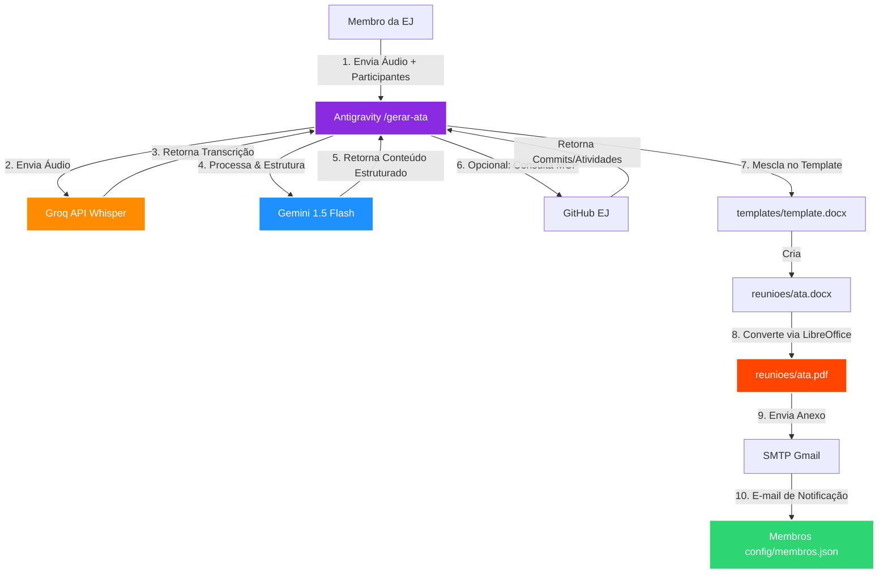

# 🎙️ Workflow Gerador de Atas (EJ-SI)

[](#)
[](#)
[](#)
[](#)

Uma solução automatizada e inteligente desenvolvida sob medida para a **Empresa Júnior de Sistemas de Informação (EJ-SI)**. O projeto simplifica e automatiza por completo o ciclo de vida das atas de reuniões, convertendo áudios gravados em documentos oficiais formatados e distribuindo-os automaticamente por e-mail para todos os membros da organização.

---

## 💡 Visão Geral & Proposta de Valor

A criação de atas de reunião é um processo tradicionalmente manual, lento e sujeito a omissões. As abordagens anteriores com IAs comuns falhavam em transcrever jargões técnicos da área de TI e em categorizar corretamente os direcionamentos. 

Este workflow resolve esse problema por meio de uma **automação orquestrada por agente no Antigravity**:
* **Transcrição de Alta Precisão (Custo Zero):** Utiliza a API do **Groq (Whisper Large)** para decodificar até 40 minutos de áudio em segundos, interpretando termos técnicos e siglas de tecnologia com precisão.
* **Sumarização Estruturada:** Processada com modelos avançados de IA para separar a discussão em pontos de pauta, decisões e planos de ação.
* **Identidade Visual Preservada:** Preenche dinamicamente um arquivo base `.docx` que carrega a identidade visual oficial da Empresa Júnior (cabeçalho, banner e rodapé).
* **Distribuição Automática:** Converte o documento final para `.pdf` e o envia de forma automatizada para a lista de e-mails dos membros em `config/membros.json`.

---

## 🏗️ Arquitetura da Solução

O fluxo de dados da reunião é executado de forma sequencial pelo agente através do seguinte pipeline:




---

## 📅 Fases do Projeto

O desenvolvimento foi estruturado em quatro fases principais para garantir testes e validações sucessivas:

| Fase | Escopo / Foco | Entregáveis |
| :--- | :--- | :--- |
| **Fase 1: MVP** | Transcrição básica e Sumarização | Comando `/gerar-ata` funcional, integração com Groq Whisper, geração de resumo simples identificando tópicos e participantes. |
| **Fase 2: Template** | Formatação Institucional | Integração com arquivo `.docx` template da EJ, preenchimento dinâmico sem quebra de estilo e exportação em Word. |
| **Fase 3: GitHub (MCP)** | Enriquecimento de Contexto | Chamada MCP para ler commits e pull requests da equipe e anexar o status de progresso diretamente na ata gerada. |
| **Fase 4: PDF e E-mail** | Distribuição e Envio | Conversão headless para `.pdf` via LibreOffice e disparo SMTP automatizado para a base de membros cadastrados. |

---

## 📂 Estrutura do Repositório

```bash
workflow-ata/
├── .agents/                    # Diretório do agente Antigravity
│   └── workflows/
│       ├── gerar-ata.md        # Descrição em markdown do fluxo de trabalho do agente
│       └── gerar-ata.yaml      # Definição e configuração estrutural do workflow
├── config/
│   └── membros.json            # Base de dados de membros da EJ (Nome e E-mail)
├── fases/                      # Documentação detalhada das etapas de desenvolvimento
│   ├── fase-1-gerar-ata.md
│   ├── fase-2-gerar-ata.md
│   ├── fase-3-gerar-ata.md
│   └── fase-4-enviar-email.md
├── reunioes/                   # Pasta para armazenamento das atas e transcrições geradas
├── schemas/
│   └── schema_ata.json         # Validação estrutural dos dados da ata
├── scripts/                    # Módulos Python executados pelo workflow
│   ├── transcrever.py          # Integração com API da Groq
│   ├── estruturar_ata.py       # Chamada de inteligência para estruturar o texto
│   ├── gerar_docx.py           # Escrita no template Word (.docx)
│   ├── converter_pdf.py        # Conversão Word -> PDF usando LibreOffice Headless
│   └── enviar_email.py         # Orquestração do disparo de e-mails via SMTP
├── templates/
│   └── template.docx           # Layout visual padrão da Empresa Júnior
├── .env.example                # Modelo de variáveis de ambiente do projeto
├── .gitignore                  # Arquivos ignorados pelo Git (com exceção para workflows)
├── PRD.md                      # Product Requirements Document detalhado
└── README.md                   # Esta documentação
```

---

## ⚙️ Configuração e Instalação

### Pré-requisitos
1. **Python 3.10+** instalado.
2. **LibreOffice** instalado no sistema (necessário para a conversão headless de `.docx` para `.pdf` no Linux):
   ```bash
   sudo apt update
   sudo apt install libreoffice-writer --no-install-recommends
   ```

### Passo a Passo

1. **Clonar o Repositório:**
   ```bash
   git clone https://github.com/seu-usuario/workflow-ata.git
   cd workflow-ata
   ```

2. **Criar e Ativar Ambiente Virtual:**
   ```bash
   python3 -m venv .venv
   source .venv/bin/activate
   pip install -r requirements.txt
   ```

3. **Configurar as Variáveis de Ambiente:**
   Copie o arquivo `.env.example` para `.env`:
   ```bash
   cp .env.example .env
   ```
   Abra o arquivo `.env` e preencha com as suas chaves e dados de SMTP:
   ```env
   GROQ_API_KEY=gsk_sua_chave_groq_aqui
   SMTP_HOST=smtp.gmail.com
   SMTP_PORT=587
   SMTP_USER=seu_email@gmail.com
   SMTP_PASSWORD=sua_senha_de_aplicativo_aqui
   ```
   > ⚠️ **Nota:** Para o Gmail, utilize uma **Senha de Aplicativo** gerada nas configurações de segurança de sua Conta Google, nunca a sua senha pessoal principal.

4. **Cadastrar Membros da EJ:**
   Edite o arquivo `config/membros.json` com a lista dos membros que deverão receber a ata por e-mail:
   ```json
   [
     {
       "nome": "João Silva",
       "email": "joao.silva@empresajunior.com"
     },
     {
       "nome": "Maria Souza",
       "email": "maria.souza@empresajunior.com"
     }
   ]
   ```

---

## 🔄 Versionamento e Rastreabilidade

Para garantir que a inteligência do agente e um caso de uso prático estejam sempre disponíveis para a equipe (e para a avaliação acadêmica), o projeto segue regras estritas de versionamento no `.gitignore`:

### 🤖 Workflows e Configurações do Agente
A pasta `.agents/` contém caches e arquivos de uso local temporários (como skills instaladas), que não devem ser enviados ao Git. Contudo, as instruções de fluxo (`workflows`) devem ser mantidas sob controle de versão.
A regra abaixo garante o rastreamento exclusivo das definições de workflows:
```gitignore
# Ignorar pastas internas dos agentes, exceto os workflows
.agents/*
!.agents/workflows/
```

### 📁 Pasta de Reuniões (`reunioes/`)
Novas reuniões e atas geradas no dia a dia não devem ser versionadas para não inflar o repositório com arquivos grandes ou confidenciais (como áudios e transcrições completas).
No entanto, mantemos uma **pasta de exemplo base** (`reunioes/exemplo_2026-05-28/`) com o arquivo de participantes e as atas finais geradas (`ata.docx`, `ata.pdf`, `ata.json`) para servir como modelo de validação.
Para atingir este comportamento, as seguintes regras são aplicadas:
```gitignore
# Reuniões (ignorar futuras execuções, mas manter a de exemplo e a estrutura)
reunioes/*
!reunioes/.gitkeep
!reunioes/exemplo_2026-05-28/
```
Isso garante que:
- O arquivo de áudio (`audio.m4a`), a transcrição e o rascunho simplificado da pasta de exemplo sejam sempre ignorados (regras globais de mídia e arquivos temporários).
- Todos os arquivos de novas reuniões criadas futuramente dentro de `reunioes/` sejam ignorados automaticamente.
- A pasta de exemplo base (sem o áudio) e a estrutura vazia de diretórios (através do `.gitkeep`) permaneçam rastreadas.

---

## 🚀 Como Executar no Antigravity

A execução do workflow é 100% interativa e automatizada a partir do chat do Antigravity:

1. Abra o chat do agente no workspace do projeto.
2. Acione o workflow digitando o comando `/gerar-ata`.
3. O agente solicitará o arquivo de áudio da reunião (ex: `.mp3`, `.m4a` ou `.wav`) e a confirmação dos membros presentes.
4. Anexe o arquivo de áudio e informe os participantes presentes.
5. O agente processará as fases em segundo plano:
   - Fará o upload do áudio para transcrição via Groq Whisper.
   - Gerará o sumário inteligente.
   - Criará a ata em Word (`reunioes/exemplo_YYYY-MM-DD/ata.docx`).
   - Converterá a ata para PDF (`reunioes/exemplo_YYYY-MM-DD/ata.pdf`).
   - Disparará e-mails SMTP para a lista cadastrada no `config/membros.json`.
6. Ao final do fluxo, o agente confirmará o envio bem-sucedido diretamente no chat.
