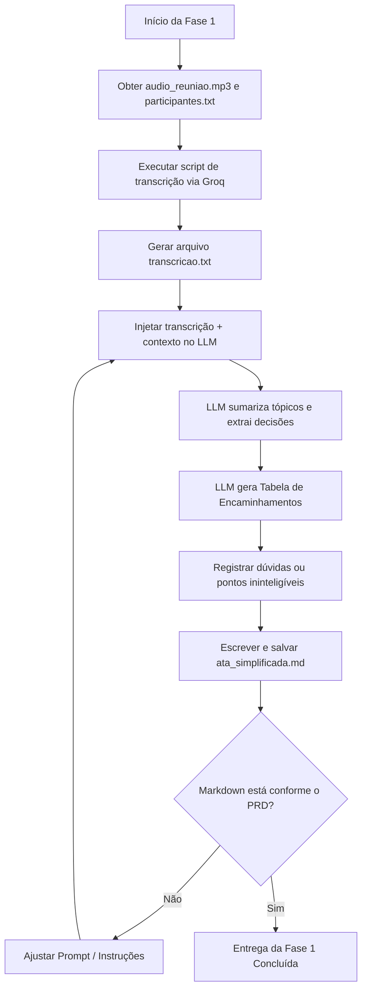

# Fase 1: MVP do Workflow de Atas

## Propósito de Desenvolvimento
Esta fase inicial foca em validar o núcleo do processamento de inteligência artificial do projeto: obter uma transcrição de alta qualidade (em português e com gírias corporativas/tecnológicas da EJ) sem custos e transformá-la em um resumo estruturado preliminar.

## Objetivo
Construir e testar o workflow básico que transcreve o arquivo de áudio de uma reunião e gera um documento em Markdown (`ata_simplificada.md`) estruturado em tópicos, contendo as decisões tomadas e os responsáveis.

## Passos Esperados do Workflow
1. Disponibilizar o arquivo de áudio (`audio_reuniao.mp3`) e a lista de participantes (`participantes.txt`) no diretório do projeto.
2. Executar o script de transcrição integrado com a API da Groq para obter o texto limpo em `transcricao.txt`.
3. Processar a transcrição usando o LLM no Antigravity para consolidar as discussões.
4. Organizar os encaminhamentos em uma tabela com Ação, Responsável e Prazo.
5. Indicar no documento qualquer dúvida, fala ininteligível ou incerteza explícita.
6. Gerar a ata estruturada em `ata_simplificada.md`.

## Entrega Clara
`ata_simplificada.md`

O arquivo deve conter:
- **Título da Reunião** (com data e contexto, se identificados).
- **Participantes Presentes** (cruzando a lista de entrada com os palestrantes detectados no áudio).
- **Resumo dos Assuntos Discutidos** (separado por blocos lógicos de tópicos).
- **Tabela de Encaminhamentos** (colunas: Ação, Responsável, Prazo).
- **Registro de Dúvidas / Incertezas** (trechos do áudio de baixa confiança ou decisões não concluídas).

## Demonstração Mínima
Ao final desta fase, o usuário deve enviar um arquivo de áudio de teste, executar as etapas e abrir o arquivo `ata_simplificada.md` contendo o resumo estruturado e fidedigno ao conteúdo da gravação.

## Validação Simplificada
- Transcrever com sucesso um áudio de teste de pelo menos 5 minutos.
- Gerar o documento markdown com todas as 5 seções obrigatórias especificadas.
- Certificar-se de que a tabela de encaminhamentos contém pelo menos 1 item resolvido (com responsável).

## Fora do Escopo desta Fase
- Preenchimento do template oficial `.docx` (será realizado na Fase 2).
- Integração com repositórios GitHub via MCP (será realizado na Fase 3).
- Validação automatizada de formatos ou esquemas JSON.

## Critérios de Conclusão
- O script de transcrição via Groq funciona localmente de forma estável.
- O modelo de IA gera resumos claros e objetivos a partir do texto transcrito.
- Incertezas de transcrição/compreensão são destacadas visualmente.
- O resultado em Markdown está pronto para alimentar a engine de template `.docx` na fase seguinte.

## Fluxo do Workflow

