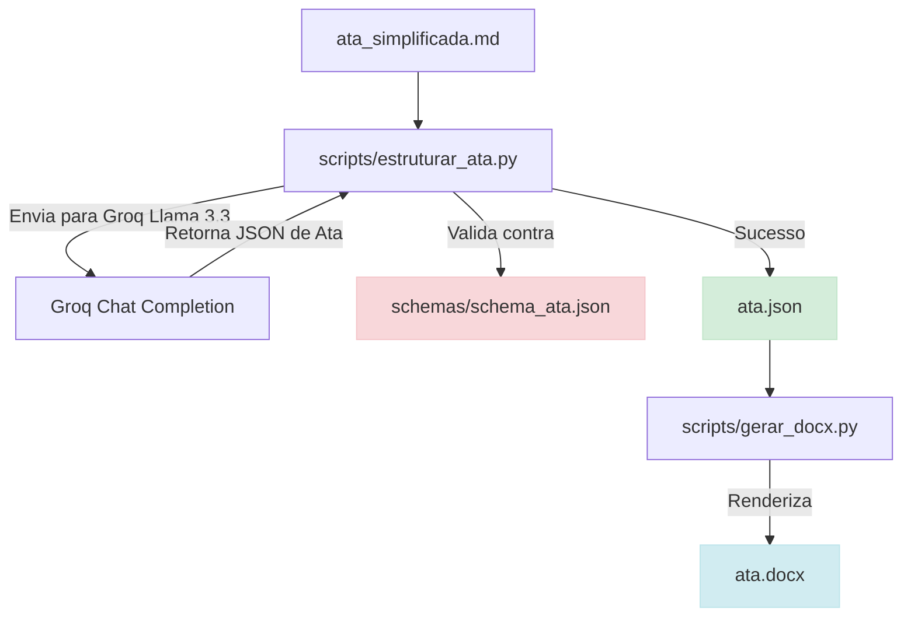

# Fase 2: Contratos JSON, Validação e Geração de Word (.docx)

## Propósito de Desenvolvimento

Esta fase demonstra o poder da **redução de ambiguidade** ao forçar que a IA estruture as informações extraídas em um formato de dados totalmente previsível e validável (**JSON**). 
Em seguida, esses dados são consumidos por uma rotina programática em Python para preencher um modelo formal no Word (`.docx`), garantindo a conformidade com as regras de identidade visual e diagramação da Empresa Júnior (EJ).

---

## Objetivos da Fase

1. Criar um contrato formal (**JSON Schema**) para validar as informações de uma ata de reunião.
2. Converter a ata simplificada (`ata_simplificada.md`) em uma estrutura de dados JSON (`ata.json`) validando-a contra o schema.
3. Garantir a resiliência a falhas simulando um JSON malformado e verificando se o validador o rejeita.
4. Ler o JSON e gerar o documento oficial formatado em Word (`ata.docx`), automatizando a diagramação institucional.

---

## Fluxo de Execução (Fase 2)

---

## Entregas de Arquivos

*   **`schemas/schema_ata.json`**: O contrato de dados definindo tipos, campos obrigatórios, arrays e padrões (regex) esperados.
*   **`scripts/estruturar_ata.py`**: O script que faz a interface com o Groq para gerar o JSON e faz a validação local usando a biblioteca `jsonschema`.
*   **`scripts/gerar_docx.py`**: O script que lê o JSON e monta o arquivo de Word formatado e diagramado.
*   **`reunioes/<data_assunto>/ata.json`**: Os dados estruturados da ata específica.
*   **`reunioes/<data_assunto>/ata.docx`**: O documento final gerado.

---

## Critérios de Conclusão

1. **Validação Estrita:** O arquivo `schema_ata.json` valida corretamente o arquivo `ata.json`.
2. **Resiliência:** Se modificarmos manualmente o JSON para desrespeitar o contrato (ex: alterando a data para "texto inválido"), a biblioteca `jsonschema` deve acusar o erro em tempo de execução.
3. **Qualidade Visual do Word:** O arquivo `.docx` gerado programaticamente deve ser estruturado com:
    *   Tabela formatada de encaminhamentos com bordas e coloração específicas.
    *   Cabeçalho institucional elegante e paginação automática no rodapé.
    *   Ausência de placeholders ou erros de formatação.
