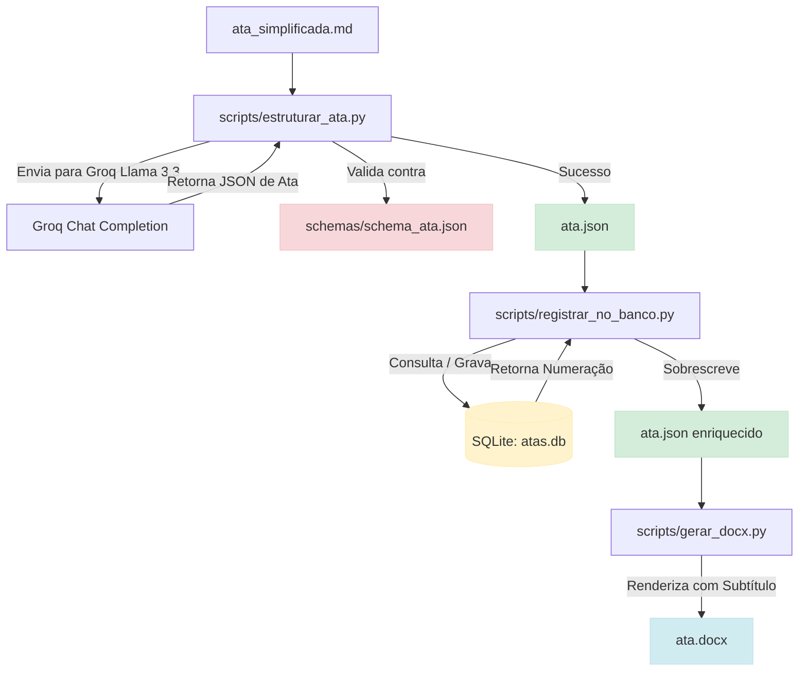

# Fase 3: Persistência Local e Numeração Automatizada com SQLite

## Propósito de Desenvolvimento

Esta fase implementa o controle organizacional de numeração e histórico de reuniões da Empresa Júnior (EJ). 
Por meio de um banco de dados **SQLite** embarcado (`atas.db`), o sistema rastreia de forma resiliente a ordem cronológica de todas as reuniões e calcula automaticamente a numeração da próxima ata baseando-se no semestre e ano corrente da data da reunião. 
Essas informações são gravadas no banco de dados, injetadas como metadados adicionais no JSON e renderizadas sob o título principal no documento oficial em Word (`.docx`).

---

## Objetivos da Fase

1. Criar e inicializar um banco de dados local leve (`atas.db`) com uma estrutura de dados de controle de atas.
2. Calcular automaticamente o ano e o semestre da ata com base em sua data de realização (ex: Janeiro-Junho = Semestre 1; Julho-Dezembro = Semestre 2).
3. Obter o próximo número sequencial incrementado de forma concorrente e resiliente (reiniciando a contagem a cada novo semestre).
4. Evitar duplicidade caso o workflow de geração seja re-executado para a mesma ata (mesma data e assunto).
5. Injetar a numeração `"Ata nº XX / YYYY.Z"` logo abaixo do título principal no Word (`.docx`) de forma visualmente alinhada com as cores e tipografia da EJ.

---

## Fluxo de Execução (Fase 3)

---

## Entregas de Arquivos

*   **`scripts/db_atas.py`**: Gerenciador utilitário de conexão e lógica com o SQLite (`atas.db`), responsável por calcular a numeração baseada na semestralidade e evitar colisões/duplicados.
*   **`scripts/registrar_no_banco.py`**: Script intermediário que lê a ata estruturada em JSON, executa o registro no SQLite, obtém os metadados computados e enriquece o arquivo JSON original.
*   **`schemas/schema_ata.json`**: Atualizado para suportar opcionalmente os campos `numero`, `ano` e `semestre`.
*   **`scripts/gerar_docx.py`**: Atualizado para interpretar e renderizar dinamicamente a numeração sequencial no Word abaixo do título da ata.

---

## Critérios de Conclusão

1. **Idempotência (Resiliência):** Rodar o script `registrar_no_banco.py` múltiplas vezes com o mesmo arquivo de ata não deve duplicar o registro no banco de dados e nem alterar o seu número sequencial inicial.
2. **Reinicialização Semestral:** Ao cadastrar uma ata de data `2026-05-10` e outra de `2026-08-15`, o banco deve registrar corretamente semestre `1` (com número `1`) e semestre `2` (reiniciando com número `1`), respectivamente.
3. **Harmonia Visual no Word:** O documento final gerado em `.docx` deve exibir centralizado e em destaque (Roxo Oficial da EJ, 12pt, Negrito, Times New Roman) a informação de identificação: `Ata nº XX / YYYY.Z`.
