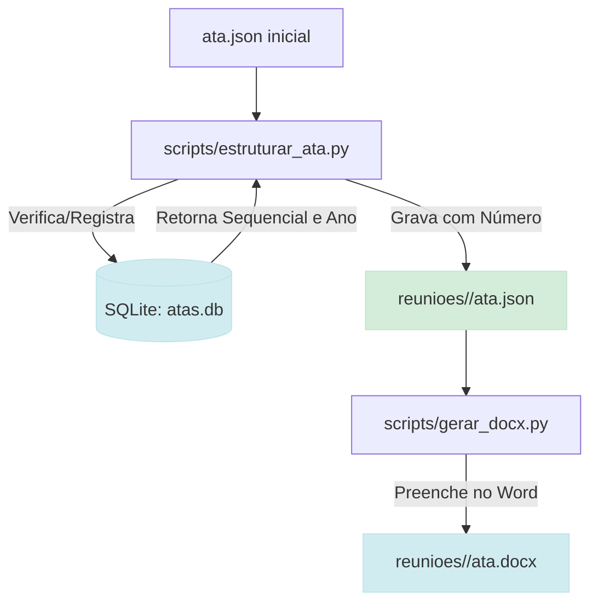

# Fase 3: Persistência Local e Numeração Automatizada (SQLite)

## Propósito de Desenvolvimento

Esta fase estabelece a camada de persistência local do workflow, garantindo a consolidação histórica de todas as atas geradas pela Empresa Júnior. Ao substituir a necessidade de integrações externas complexas por um banco de dados **SQLite** robusto e de baixo acoplamento (`atas.db`), o workflow ganha a capacidade de calcular automaticamente a numeração sequencial oficial da ata de forma totalmente idempotente, evitando falhas humanas e redundâncias no registro formal das reuniões.

---

## Objetivos da Fase

1. Criar um banco de dados SQLite local (`atas.db`) com estrutura relacional adequada para persistir atas de reunião e seus metadados.
2. Desenvolver um mecanismo programático para consultar o banco e calcular automaticamente a numeração sequencial de cada ata com base no semestre e ano correntes.
3. Garantir a idempotência do registro: reprocessar a mesma reunião deve atualizar seus metadados sem incrementar a numeração ou duplicar registros no histórico.
4. Integrar o número gerado diretamente ao arquivo `ata.json` estruturado e ao documento final em Word (`ata.docx`).

---

## Fluxo de Execução (Fase 3)

```mermaid
graph TD
    A[ata.json inicial] --> B[scripts/estruturar_ata.py]
    B -->|Verifica/Registra| C[(SQLite: atas.db)]
    C -->|Retorna Sequencial e Ano| B
    B -->|Grava com Número| D[reunioes/<data_assunto>/ata.json]
    D --> E[scripts/gerar_docx.py]
    E -->|Preenche no Word| F[reunioes/<data_assunto>/ata.docx]
    
    style C fill:#d1ecf1,stroke:#bee5eb
    style D fill:#d4edda,stroke:#c3e6cb
    style F fill:#d1ecf1,stroke:#bee5eb
```

---

## Entregas de Arquivos

*   **`atas.db`**: Banco de dados SQLite local inicializado com as tabelas de controle de reuniões e numeração sequencial.
*   **`scripts/estruturar_ata.py`**: Atualizado para realizar a conexão SQLite, calcular o número sequencial por semestre/ano, persistir os dados da pauta/participantes e injetar o número correspondente em `ata.json`.
*   **`scripts/gerar_docx.py`**: Atualizado para renderizar a numeração sequencial oficial no cabeçalho e corpo da ata em Word.

---

## Critérios de Conclusão

1. **Idempotência Garantida:** Executar o script de estruturação repetidas vezes para a mesma data e título de reunião não cria novas linhas de histórico no banco de dados e preserva exatamente o mesmo número sequencial atribuído.
2. **Cálculo de Numeração Sequencial:** O número sequencial reinicia corretamente a cada ano ou período administrativo pré-definido.
3. **Consistência dos Dados:** O número oficial gerado no banco de dados SQLite deve ser idêntico ao gravado no arquivo de dados estruturado `ata.json` e ao preenchido na versão final do Word (`ata.docx`).
4. **Relatório Histórico:** O banco SQLite deve permitir consultas rápidas para extrair metadados das reuniões realizadas (data, título, participantes, resumo dos assuntos e arquivos gerados).
